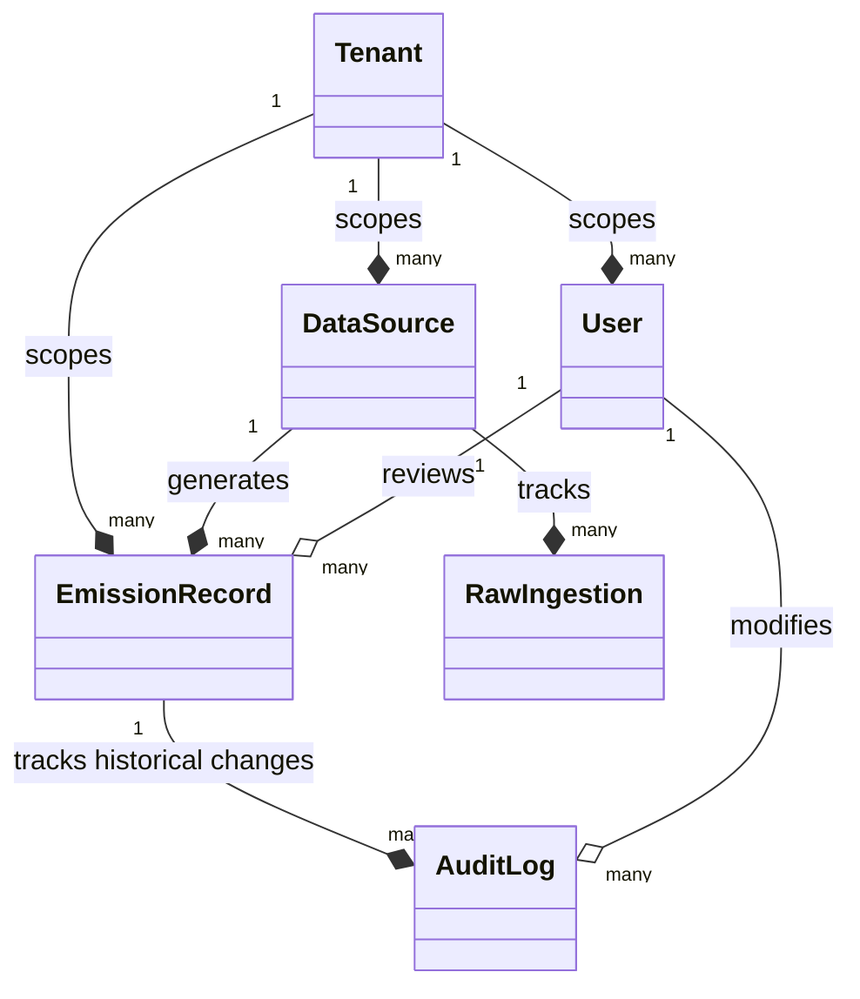
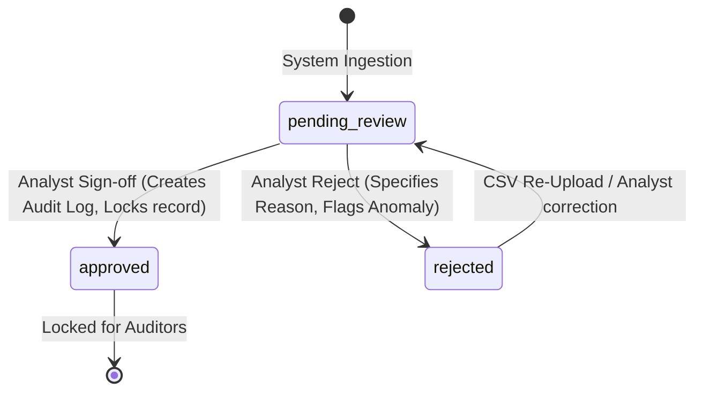

# Breathe ESG Data Models & Compliance Schema

This document provides a detailed breakdown of the multi-tenant database models built for the Breathe ESG carbon emissions ingestion and analyst review platform.

---

## 1. Database Architecture & Models

### `Tenant`
Enforces the primary structural boundary in our multi-tenant SaaS architecture. All business transactions, emission records, and analyst reviews are scoped to a `Tenant`.
* `id` (BigAutoField): Primary key.
* `name` (CharField): The legal name of the organization (e.g., "Acme Corporation").
* `created_at` (DateTimeField): System timestamp of tenant provisioning.

### `User` (extends Django's AbstractUser)
Extends standard Django authentication to associate analysts and administrators directly with their corporate tenant.
* `tenant` (ForeignKey -> Tenant): The company this user belongs to. Allows NULL for global system admins.
* `role` (CharField): Choices are `analyst` (standard ESG data reviewer) and `admin` (can manage data sources and configurations).

### `DataSource`
Represents an upstream system or conduit from which raw CSV files originate.
* `tenant` (ForeignKey -> Tenant): Scopes the source to the parent company.
* `source_type` (CharField): The source system type. Choices are:
  - `SAP`: SAP Fuel & Procurement flat-file exports.
  - `UTILITY`: Grid electricity portal billing records.
  - `TRAVEL`: Corporate travel Concur-style expense exports.
* `created_at` (DateTimeField): Timestamp when this ingestion stream was registered.

### `RawIngestion`
Tracks the processing state of uploaded CSV files to preserve raw audit trails.
* `source` (ForeignKey -> DataSource): The data stream associated with this upload.
* `raw_file` (FileField): Path to the saved CSV file in our encrypted storage bucket.
* `status` (CharField): The current status of the parser pipeline. Choices are:
  - `pending`: Awaiting background parsing.
  - `processing`: Engine actively running conversion algorithms.
  - `failed`: parsing aborted due to schema corruption.
  - `done`: Records generated, verified, and saved.
* `ingested_at` (DateTimeField): Timestamp when the analyst initiated the upload.

### `EmissionRecord`
The primary compliance model representing a normalized, auditable greenhouse gas (GHG) transaction.
* `tenant` (ForeignKey -> Tenant): The reporting organization.
* `source` (ForeignKey -> DataSource): The originating ingestion pipeline.
* `scope` (IntegerField): Choice of:
  - `1`: Direct Greenhouse Gas Emissions (e.g. Fuel Combustion).
  - `2`: Indirect Energy Emissions (e.g. Purchased Grid Electricity).
  - `3`: Other Indirect Value-Chain Emissions (e.g. Travel, Procurements).
* `category` (CharField): Choices: `fuel` | `electricity` | `flight` | `hotel` | `ground`.
* `activity_value` (DecimalField): Raw numeric activity quantity recorded (e.g. 500 liters, 1000 kWh, 2400 km).
* `activity_unit` (CharField): The raw unit inputted (e.g., L, GAL, nights, km, M3).
* `normalized_value_kg_co2e` (DecimalField): Computed CO2 equivalent footprint in kilograms (`kgCO2e`).
* `emission_factor_used` (DecimalField): The specific environmental multiplier applied to the row.
* `period_start` / `period_end` (DateField): The timeline boundary for the carbon emission.
* `source_ref` (CharField): Original row identifier (such as SAP document ID or Concur expense ID) for auditing tracebacks.
* `is_suspicious` (BooleanField): Anomaly flag set if the transaction violates verification checks.
* `suspicion_reason` (TextField): Multi-line explanation detailing why the record was flagged as anomalous.
* `status` (CharField): Compliance lifecycle state. Choices are:
  - `pending_review`: Ingested, waiting for analyst verification.
  - `approved`: Reviewed and signed off. Cannot be modified again.
  - `rejected`: Returned for correction with reason. Can be re-reviewed later.
* `reviewed_by` (ForeignKey -> User): The analyst who signed off on the record.
* `reviewed_at` (DateTimeField): Timestamp of the review action.
* `created_at` / `updated_at` (DateTimeField): System database tracking timestamps.

### `AuditLog`
An immutable compliance ledger. Every create, state modification, and review action creates a row.
* `record` (ForeignKey -> EmissionRecord): The emission record under audit.
* `action` (CharField): The action token (e.g. `ingested`, `approved`, `rejected`).
* `changed_by` (ForeignKey -> User): The identity (analyst or system trigger) executing the change.
* `changed_at` (DateTimeField): Timestamp of the audit event.
* `before_state` (JSONField): Complete serialized JSON snapshot of the `EmissionRecord` before the change. Null for new ingests.
* `after_state` (JSONField): Complete serialized JSON snapshot of the `EmissionRecord` after the change.

---

## 2. Multi-Tenancy Architecture Design

Our platform enforces **Logical Database-Level Multi-Tenancy** via Shared-Database, Shared-Schema isolation:
1. Every model (except global defaults and custom users) is foreign-keyed to a `Tenant` model.
2. In production, Django middleware intercepts every incoming HTTP request, resolves the authenticated `User` session, and dynamically applies a global filter to all ORM queries (e.g. `EmissionRecord.objects.filter(tenant=request.user.tenant)`).
3. This guarantees that Client A can never view, mutate, or ingest data belonging to Client B. Even in aggregate statistics, tenant boundaries are strictly isolated.

---

## 3. GHG Scope & Category Selection Matrix

The platform automatically classifies emissions according to the Greenhouse Gas (GHG) Protocol:

| Data Source | Material / Trigger | Computed Scope | Category Code | Emission Factor Applied |
| :--- | :--- | :--- | :--- | :--- |
| **SAP** | Fuels (`DIESEL`, `PETROL`, `NATURAL_GAS`) | **Scope 1** (Direct Combustion) | `fuel` | Diesel: 2.68 kgCO2e/L  Petrol: 2.31 kgCO2e/L  Natural Gas: 2.04 kgCO2e/m3 |
| **SAP** | Other Materials (e.g. `STEEL`, `PLASTIC`) | **Scope 3** (Purchased Goods) | `fuel` | Default General Procurement: 1.25 kgCO2e/kg |
| **UTILITY** | Grid electricity invoices | **Scope 2** (Indirect Energy) | `electricity` | India Grid Average: 0.82 kgCO2e/kWh |
| **TRAVEL** | Travel type: `FLIGHT` (Economy Cabin) | **Scope 3** (Business Travel) | `flight` | 0.255 kgCO2e/km |
| **TRAVEL** | Travel type: `FLIGHT` (Business Cabin) | **Scope 3** (Business Travel) | `flight` | 0.612 kgCO2e/km |
| **TRAVEL** | Travel type: `HOTEL` | **Scope 3** (Business Travel) | `hotel` | 31.200 kgCO2e/night |
| **TRAVEL** | Travel type: `GROUND` (Taxis, etc.) | **Scope 3** (Business Travel) | `ground` | 0.210 kgCO2e/km |

---

## 4. Compliance Auditing State Machine

To prevent greenwashing and data tampering, the platform implements a secure state machine:

* **Immutable Sign-Off**: Once a record is marked `approved`, it is locked. The backend API checks `record.status == 'approved'` and rejects any PATCH requests, ensuring signed-off emissions cannot be altered retroactively.
* **Audit ledger**: The `AuditLog` captures complete before/after snapshots of the records as JSON strings. This allows external auditors to trace the exact lineage of an emissions record—who uploaded the raw data, what anomalies were detected, what rejection cycles occurred, and which analyst authorized the final entry.
